# altoro_mutual_test

***Testers:***
- Laura Danniela Zarate Guerrero
- Miguel Angel Cock Cano

## EXEL LINK

https://1drv.ms/x/c/980a678827ce5c88/EWfM-PfNH_1IqPPBNCKRaf4BgO-GvHXeTOF3uGBOqSfH4w?e=IvMECK

## Authentication

### 2.1.1
Server returning a success message (200 OK) even though the normalized password length is below 12 characters.

Request:
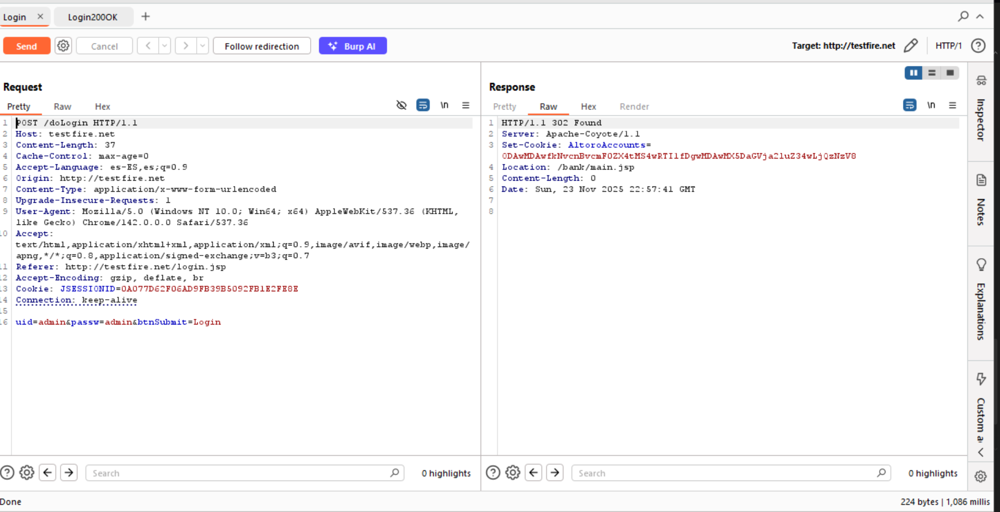

200 OK Response:
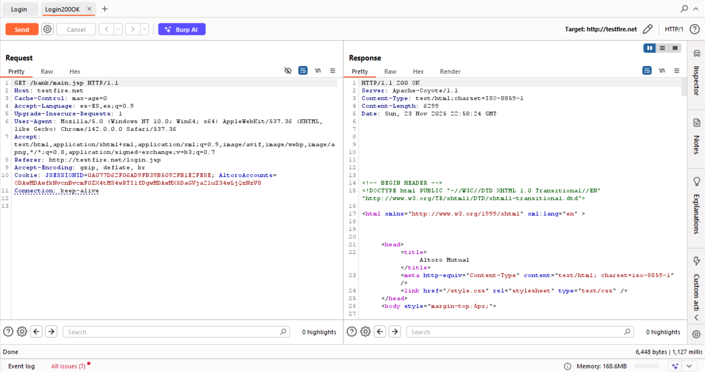

#### FIX:


### 2.1.2
Server returning a 302 Found Messsage when the password lenght is more than 64 characters but also when the password lenght is way above 128 characters.

64 Characters Response:
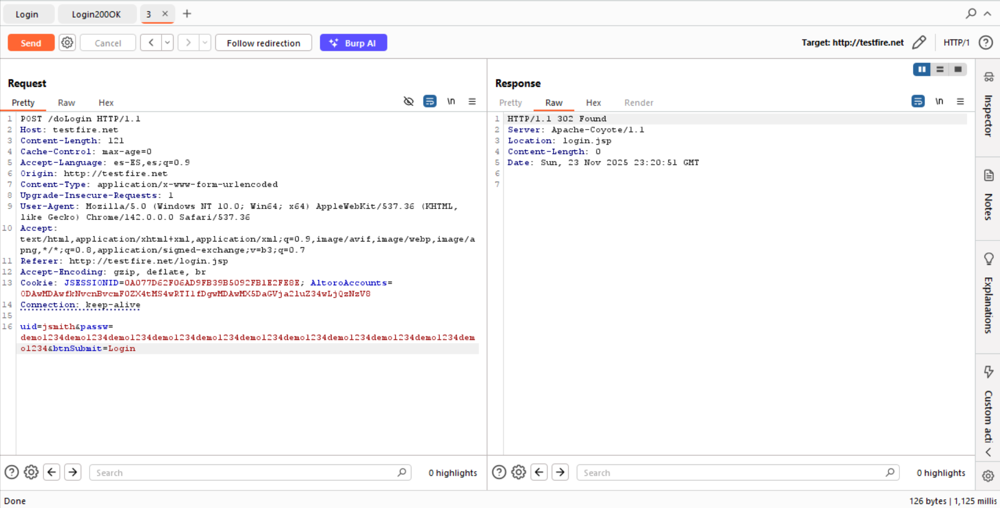

128 Characters Response:
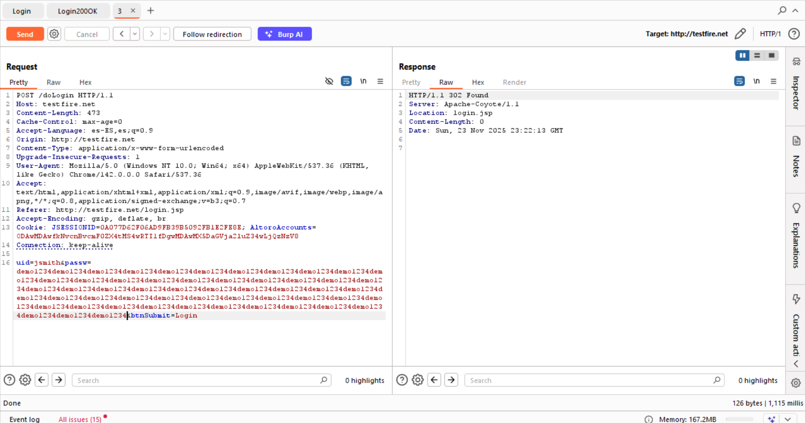

#### FIX:


### 2.1.3

### 2.1.4

### 2.1.5

### 2.1.6

### 2.1.7

### 2.1.8

### 2.1.9

### 2.1.10

### 2.1.11

### 2.1.12

---

### 2.2.1

### 2.2.2

### 2.2.3

### 2.2.4

### 2.2.5

### 2.2.6

### 2.2.7

---

### 2.4.1 - 2.4.5

As seen in the code when a new user is created the password is saved directly as plain text:

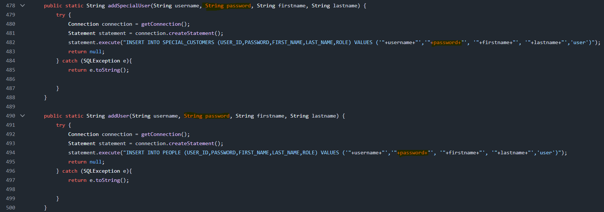

#### FIX:

To solve the issues it is going to be nesessary to encrypt the passwords with an strong hashing function, when saved in the DB and us a tool to create a salt for it.

Below is a **complete, correct, ASVS-compliant fix** for `addUser` and `addSpecialUser` using:

**Step 1 — Add BCrypt dependency**

**Step 2 — Add a method for hashing passwords with pepper**

Place this in `DBUtil.java` or a new class like `SecurityUtil.java`:

```java
public static String hashPassword(String password) {
    // Load pepper from environment variable
    String pepper = System.getenv("APP_PEPPER");
    if (pepper == null) {
        throw new RuntimeException("Missing APP_PEPPER environment variable");
    }

    // Apply pepper
    String pepperedPassword = password + pepper;

    // bcrypt automatically generates salt internally
    int workload = 12; // cost factor
    return BCrypt.hashpw(pepperedPassword, BCrypt.gensalt(workload));
}
```

**Step 3 — Fix addUser and addSpecialUser**

~~~java
public static String addSpecialUser(String username, String password, String firstname, String lastname) {
		try {
			Connection connection = getConnection();

            //use the new password hasher
            String hashedPassword = hashPassword(password);

			Statement statement = connection.createStatement();
			statement.execute("INSERT INTO SPECIAL_CUSTOMERS (USER_ID,PASSWORD,FIRST_NAME,LAST_NAME,ROLE) VALUES ('"+username+"','"+hashedPassword+"', '"+firstname+"', '"+lastname+"','user')");
			return null;
		} catch (SQLException e){
			return e.toString();
			
		}
	}
	
	public static String addUser(String username, String password, String firstname, String lastname) {
		try {
			Connection connection = getConnection();

            //use the new password hasher
            String hashedPassword = hashPassword(password);

			Statement statement = connection.createStatement();
			statement.execute("INSERT INTO PEOPLE (USER_ID,PASSWORD,FIRST_NAME,LAST_NAME,ROLE) VALUES ('"+username+"','"+hashedPassword+"', '"+firstname+"', '"+lastname+"','user')");
			return null;
		} catch (SQLException e){
			return e.toString();
			
		}
	}
~~~

**Step 4 — Add Pepper**

In your system:

Linux/macOS:

```bash
export APP_PEPPER="VerySecretRandomKeyValue_GenerateThis"
```

Windows PowerShell:

```powershell
setx APP_PEPPER "VerySecretRandomKeyValue_GenerateThis"
```

Use a long random key (32+ characters).


## Access Control

### 4.1.1

Admin panel accessed by non admin user.

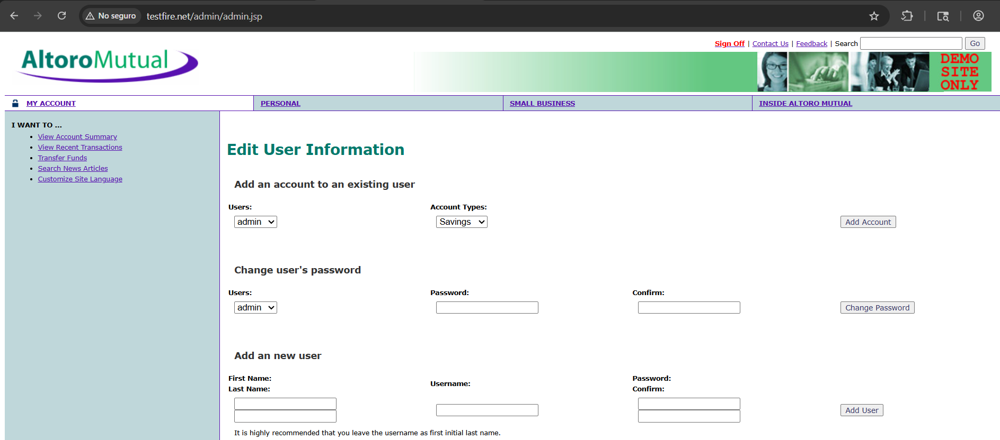

Admin panel accessed by admin user.

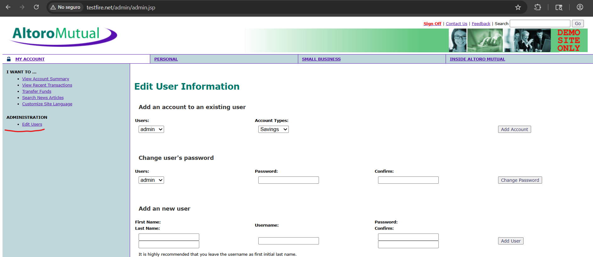

#### FIX:

Add the following code at the third line of [admin.jsp](https://github.com/HCL-TECH-SOFTWARE/AltoroJ/blob/AltoroJ-3.2/WebContent/admin/admin.jsp) to solve the issue.

~~~JSP
<%
    User user = (com.ibm.security.appscan.altoromutual.model.User)request.getSession().getAttribute("user");

    if (user == null || user.getRole() != User.Role.Admin) {
        response.sendError(HttpServletResponse.SC_FORBIDDEN, "Access denied");
        return;
    }
%>
~~~

### 4.1.2

Example of non admin user changing the password of arbritary user.

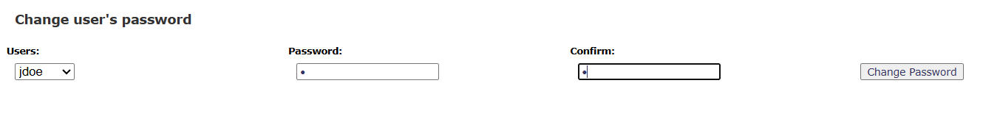

Burp showing 200 OK response to the request.


#### FIX:

Add the following code at line 41 [AdminServlet.java](https://github.com/HCL-TECH-SOFTWARE/AltoroJ/blob/AltoroJ-3.2/src/com/ibm/security/appscan/altoromutual/servlet/AdminServlet.java) so non admin users cant make admin actions.

~~~java
User user = (User) request.getSession().getAttribute("user");

if (user == null) {
    response.sendError(HttpServletResponse.SC_UNAUTHORIZED, "Login required");
    return;
}

if (user.getRole() != User.Role.Admin) {
    response.sendError(HttpServletResponse.SC_FORBIDDEN, "Admin only");
    return;
}
~~~

### 4.1.3

The proof that invalidates this one can be the previous points 4.1.1 and 4.1.2, since a non admin user should not have the provilege of accessing and doing admin actions

#### FIX:

The fix from 4.1.2 remediates this issue too.

### 4.1.5

This one gets its proof from 4.1.1 and 4.1.2 since the app should be failing when a non admin user tries to access admin functionalities

#### FIX:

Both fixes from 4.1.1 and 4.1.2 would remediates this issue allowing the app to fail safely.

---

### 4.2.1

The test account should only have access to this information:

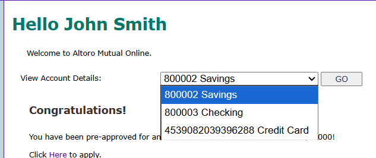

By changing the *listAccounts* parameter in the URL it was possible to access the account information of another user

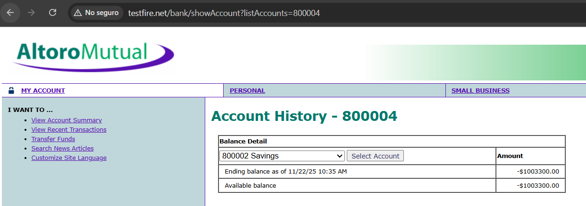

#### FIX:

To solve the issue add this code in the 42 line of the file [balance.jsp](https://github.com/HCL-TECH-SOFTWARE/AltoroJ/blob/AltoroJ-3.2/WebContent/bank/balance.jsp) making users only accesible to their content.

~~~ java
boolean isOwned = accounts.stream().anyMatch(a -> a.getId().equals(accountName));

if (!isOwned) {
    response.sendError(HttpServletResponse.SC_FORBIDDEN, "Unauthorized account access");
    return;
}
~~~

### 4.2.2

CSRF test generated by burp:

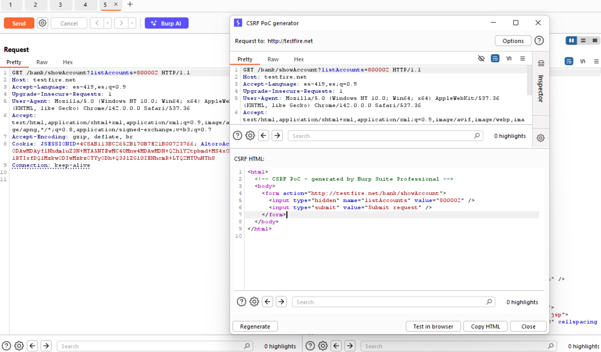

Proof in the browser:

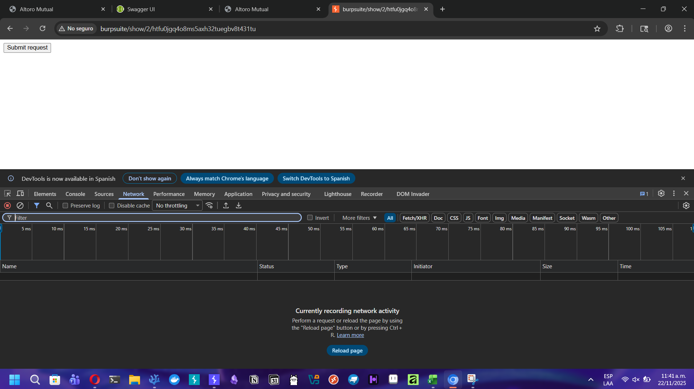

Request successful shown in developer tools:

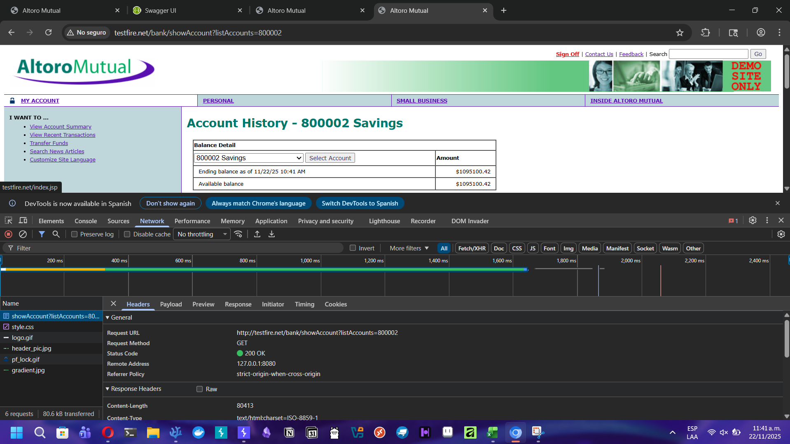

#### FIX:

To solve the issue change the code from line 94 to 96 of the file [LoginServlet.java](https://github.com/HCL-TECH-SOFTWARE/AltoroJ/blob/AltoroJ-3.2/src/com/ibm/security/appscan/altoromutual/servlet/LoginServlet.java) with the following, making request from other sites not posible.

~~~JAVA
Cookie accountCookie = ServletUtil.establishSession(username, session);

// The normal API does not support SameSite, so build manually:
String cookieValue = accountCookie.getName() + "=" + accountCookie.getValue()
        + "; Path=" + accountCookie.getPath()
        + "; HttpOnly"
        + "; Secure"
        + "; SameSite=Lax";

response.setHeader("Set-Cookie", cookieValue);
response.sendRedirect(request.getContextPath() + "/bank/main.jsp");
~~~

---

### 4.3.1

The following workflow show how there is not multifactor authentication for accessing the admin panel

1. Normal login (Since it is the same with admin login)

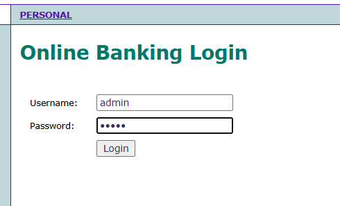

2. Admin account

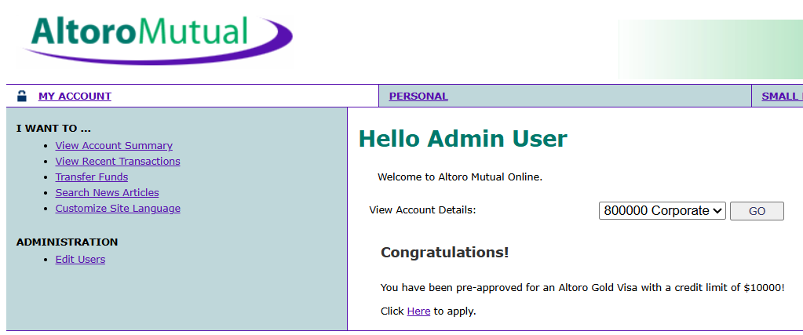

3. Admin panel

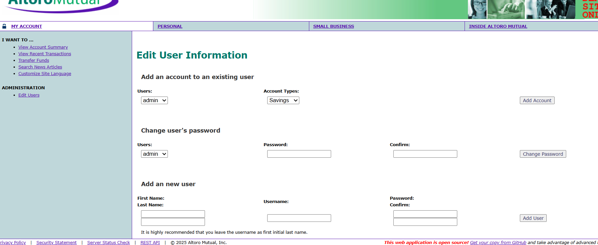

#### FIX:

To solve the issue we will implement a simple version MFA creating a code in the back and asking the user to input it in the front, if you are an admin that has access to the backend you will be able to see the code and input it in the front. This will be more of a proof of concept since the implementation of it would add new concerns to the application.

In the [LoginServlet.java](https://github.com/HCL-TECH-SOFTWARE/AltoroJ/blob/AltoroJ-3.2/src/com/ibm/security/appscan/altoromutual/servlet/LoginServlet.java) file add the following code in lines 94 to 96 so when the admin logs in, it gets redirected to the mfa page and the mfa code gets created, this will collide with the last point, so take care implementing both:

~~~ JAVA
Cookie accountCookie = ServletUtil.establishSession(username,session);
response.addCookie(accountCookie);

if (username.equals("admin")) {
    // Generate 6-digit MFA code
    int mfaCode = (int)(Math.random() * 900000) + 100000;
    session.setAttribute("mfa_code", mfaCode);

    // For class/demo – display in console
    System.out.println("MFA code for admin: " + mfaCode);

    // Redirect to MFA page instead of admin panel
    response.sendRedirect("admin/mfa.jsp");
    return;
}

response.sendRedirect(request.getContextPath()+"/bank/main.jsp");
~~~

To add the mfa page, add this file to the [admin](https://github.com/HCL-TECH-SOFTWARE/AltoroJ/tree/AltoroJ-3.2/WebContent/admin) folder, naming it ***mfa.jsp***

~~~html
<html>
<head><title>MFA Verification</title></head>
<body>
<h2>Multi-Factor Authentication</h2>
<p>A 6-digit verification code has been generated. Enter it below.</p>

<form method="POST" action="VerifyMFA">
    <input type="text" name="code" maxlength="6" />
    <input type="submit" value="Verify" />
</form>

</body>
</html>
~~~

And to confirm the code, add the following file naming it ***VerifyMFAServlet.java*** to the [servlet](https://github.com/HCL-TECH-SOFTWARE/AltoroJ/tree/AltoroJ-3.2/src/com/ibm/security/appscan/altoromutual/servlet) folder.

~~~JAVA
package com.ibm.security.appscan.altoromutual.servlet;

import java.io.IOException;
import javax.servlet.*;
import javax.servlet.http.*;

public class VerifyMFAServlet extends HttpServlet {

    protected void doPost(HttpServletRequest request, HttpServletResponse response)
        throws ServletException, IOException {

        HttpSession session = request.getSession(false);

        if (session == null) {
            response.sendRedirect("login.jsp");
            return;
        }

        String input = request.getParameter("code");
        Object stored = session.getAttribute("mfa_code");

        if (stored != null && input.equals(String.valueOf(stored))) {
            session.setAttribute("mfa_passed", true);
            session.removeAttribute("mfa_code");
            response.sendRedirect("bank/admin.jsp");
        } else {
            session.setAttribute("error", "Invalid verification code.");
            response.sendRedirect("mfa.jsp");
        }
    }
}
~~~

And lastly protect the admin panel adding this code at the start of [admin.jsp](https://github.com/HCL-TECH-SOFTWARE/AltoroJ/blob/AltoroJ-3.2/WebContent/admin/admin.jsp) in the third line.

~~~JSP
<%
if (session.getAttribute("mfa_passed") == null) {
    response.sendRedirect("../mfa.jsp");
    return;
}
%>
~~~


### 4.3.3

This one gets invalidated because of points 4.1.1, 4.1.2 and 4.3.1 since there are no checks for actions.

#### FIX:

since this problem happens becauses of the previus points, the solution of them apply to this one as well.

## Communication Security

### 9.1.1

All request can are done with HTTP here is an example of it:

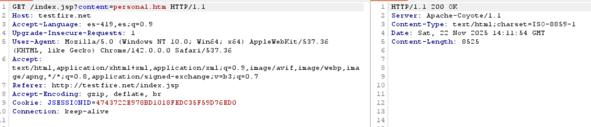

#### FIX:

To solve the issue the app must implement a certificate and add the following filter to the [filter](https://github.com/HCL-TECH-SOFTWARE/AltoroJ/tree/AltoroJ-3.2/src/com/ibm/security/appscan/altoromutual/filter)s folder.

~~~java
package com.ibm.security.appscan.altoromutual.filter;

import java.io.IOException;
import javax.servlet.*;
import javax.servlet.http.*;

public class HttpsEnforceFilter implements Filter {

    @Override
    public void init(FilterConfig filterConfig) throws ServletException {}

    @Override
    public void doFilter(ServletRequest request, ServletResponse response, FilterChain chain)
            throws IOException, ServletException {

        HttpServletRequest req = (HttpServletRequest) request;
        HttpServletResponse res = (HttpServletResponse) response;

        if (!req.isSecure()) {
            String httpsURL =
                "https://" + req.getServerName() +
                req.getRequestURI() +
                (req.getQueryString() != null ? "?" + req.getQueryString() : "");
            res.sendRedirect(httpsURL);
            return;
        }

        chain.doFilter(request, response);
    }

    @Override
    public void destroy() {}
}
~~~

---

### 9.2.1 - 9.2.5

Since the app doesnt have a certificate all of this points are invalid, thus to fix it we will need to add a certifiacte to the aplication.

#### FIX:

AltoroJ is a **Java EE webapp running on Apache Tomcat**, and **TLS/HTTPS is *not configured inside the application code***.
**You do NOT add the certificate in the GitHub repo.**
You configure HTTPS **in the application server (Tomcat)**.

AltoroJ's repo **does NOT contain any HTTPS/TLS configuration**, because it’s intentionally insecure.
So you will fix this by configuring TLS in Tomcat's `server.xml`.

---

# ✅ **Where to add the certificate for AltoroJ**

AltoroJ is deployed as a `.war` to **Apache Tomcat**, so TLS must be added in:

```
<tomcat>/conf/server.xml
```

You need to add a **Connector** with HTTPS enabled.

---

# ✅ **Step-by-step: Add HTTPS to Tomcat for AltoroJ**

### **1. Generate a keystore with a self-signed certificate**

For testing:

```bash
keytool -genkeypair -alias altoroj \
  -keyalg RSA -keysize 2048 \
  -keystore altoroj-keystore.jks \
  -validity 365
```

You’ll be asked for password + certificate details.

Move the keystore into Tomcat, e.g.:

```
/opt/tomcat/conf/altoroj-keystore.jks
```

---

### **2. Edit Tomcat’s server.xml**

Open:

```
<tomcat>/conf/server.xml
```

Find the HTTP connector (e.g. port 8080) — leave it as is.

Add **this HTTPS connector** below it:

```xml
<Connector 
    protocol="org.apache.coyote.http11.Http11NioProtocol"
    port="8443" 
    maxThreads="150"
    SSLEnabled="true"
    scheme="https" 
    secure="true"
    clientAuth="false"
    sslProtocol="TLS"
    keystoreFile="conf/altoroj-keystore.jks"
    keystorePass="YOUR_PASSWORD_HERE"
/>
```

This exposes AltoroJ at:

```
https://localhost:8443/AltoroJ/
```

---

# ✅ **3. (Optional) Enforce HTTPS Only**

To satisfy:

> “Verify that TLS is used for all client connectivity, and does not fall back to HTTP”

You can force HTTP→HTTPS redirection via:

### **Option 1 — Web.xml**

Add a security constraint:

```xml
<security-constraint>
    <web-resource-collection>
        <web-resource-name>Entire Application</web-resource-name>
        <url-pattern>/*</url-pattern>
    </web-resource-collection>
    <user-data-constraint>
        <transport-guarantee>CONFIDENTIAL</transport-guarantee>
    </user-data-constraint>
</security-constraint>
```

### **Option 2 — Tomcat redirect**

Add this HTTP connector:

```xml
<Connector port="8080" redirectPort="8443" />
```